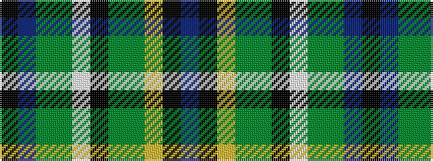

BKYGGKWGGBK

It is a 11 stripe tartan.

<figure class="pat-woven">

<figcaption>idealised sample</figcaption>
</figure>

## Colour Sequence



## Tartans with this colour sequence

| Tartans |
|---------------|
| [Teddy Bear 111th Anniversary](/variants/s11/n26k6ly32g14dy11k19w2dy16g11n19k2/)|
||
