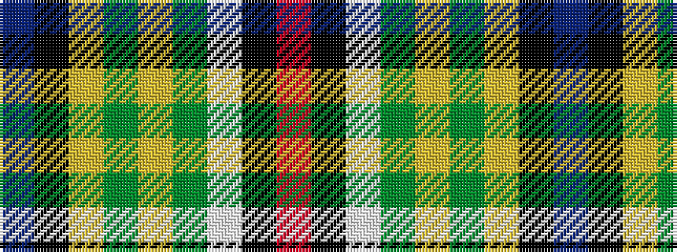

BKYGYGWKR

It is a 9 stripe tartan.

<figure class="pat-woven">

<figcaption>idealised sample</figcaption>
</figure>

## Colour Sequence



## Tartans with this colour sequence

| Tartans |
|---------------|
| [Morgan in Maryland (USA)](/setts/s9/db4k1lg18y2lg11y11lb18k1r4~x2/)|
||
