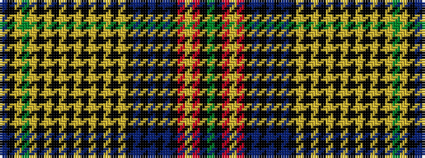

BKYGYKYKYKYKYKYKYKBKBKBKRYRKG

It is a 29 stripe tartan.

<figure class="pat-woven">

<figcaption>idealised sample</figcaption>
</figure>

## Colour Sequence



## Tartans with this colour sequence

| Tartans |
|---------------|
| [Westwood Metropolitan 1 (Fashion)](/setts/s29/db98k98ly1g10ly1k11ly1k1ly1k1ly1k1ly1k1ly1k1ly1k11db1k1db10k1db1k1r7ly1r10k10g2~x2/)|
||
