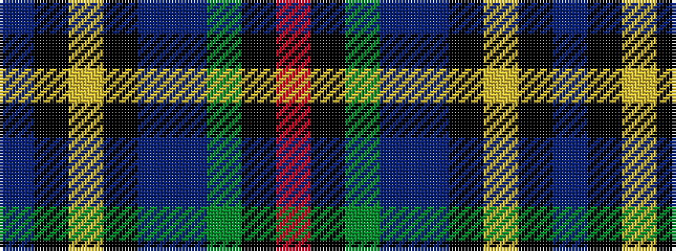

BKYKBBGKR

It is a 9 stripe tartan.

<figure class="pat-woven">

<figcaption>idealised sample</figcaption>
</figure>

## Colour Sequence



## Tartans with this colour sequence

| Tartans |
|---------------|
| [Bicentenary (Commemorative)](/variants/s9/dr6k1lo1k2db2dr4g8k1r2~x4/)|
||
