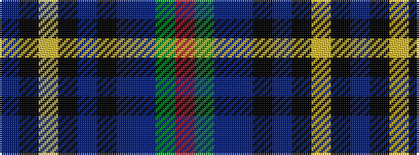

BKYKBKBBGR

It is a 10 stripe tartan.

<figure class="pat-woven">

<figcaption>idealised sample</figcaption>
</figure>

## Colour Sequence



## Tartans with this colour sequence

| Tartans |
|---------------|
| [Six Frigates (US)](/variants/s10/t3k1lo2k1db10k17db2t1dy1r1~x2/)|
||
