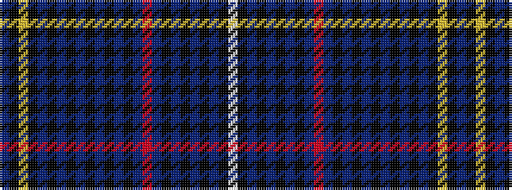

BKYKBKBKBKBKBKBRBKBKBKBKW

It is a 25 stripe tartan.

<figure class="pat-woven">

<figcaption>idealised sample</figcaption>
</figure>

## Colour Sequence



## Tartans with this colour sequence

| Tartans |
|---------------|
| [Arnold (California)](/variants/s25/db4k1lo2k1db3k1db2k2db2k4db2k2db2k1db3r1db4k19dp1k2dp3k4db4k1w2~x2/)|
||
