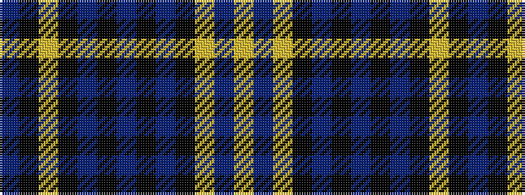

BKYKBKBKBKYBY

It is a 13 stripe tartan.

<figure class="pat-woven">

<figcaption>idealised sample</figcaption>
</figure>

## Colour Sequence



## Tartans with this colour sequence

| Tartans |
|---------------|
| [State Seal of Oregon (Fashion)](/setts/s13/b4k7lo3k3b34k17b4k5b4k7lo11b5lo4~x2/)|
||
