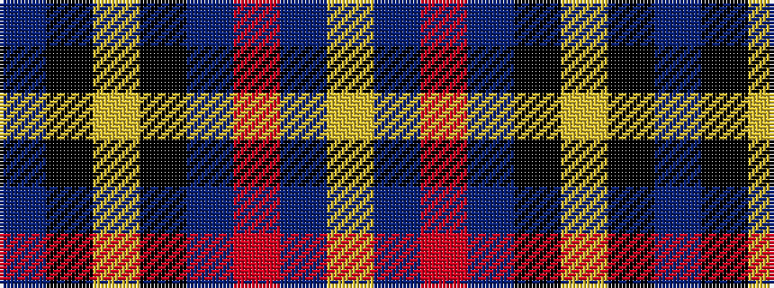

BKYKBRBY

It is a 8 stripe tartan.

<figure class="pat-woven">

<figcaption>idealised sample</figcaption>
</figure>

## Colour Sequence



## Tartans with this colour sequence

| Tartans |
|---------------|
| [Cirse 3D](/variants/s8/lo8n5r1n15k2lo1k36n1~x2/)|
||
