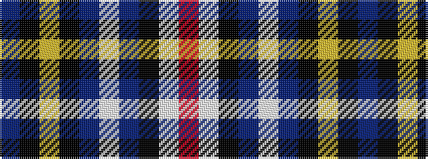

BKYKBWBKWR

It is a 10 stripe tartan.

<figure class="pat-woven">

<figcaption>idealised sample</figcaption>
</figure>

## Colour Sequence



## Tartans with this colour sequence

| Tartans |
|---------------|
| [Ambulance Victoria](/setts/s10/db73k9ly3k5db13w3t7k5w7r16/)|
||
| [Ambulance Victoria (Corporate)](/setts/s10/b73k9lo3k5b13w3t7k5w7r16/)|
||
