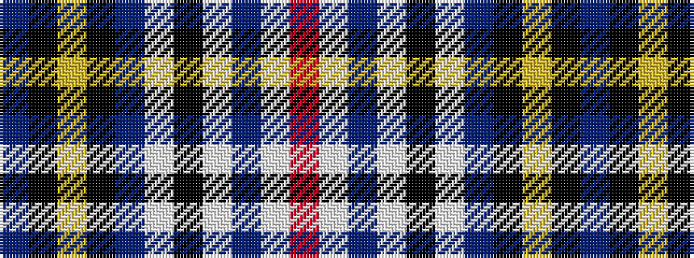

BKYKBWKWBWR

It is a 11 stripe tartan.

<figure class="pat-woven">

<figcaption>idealised sample</figcaption>
</figure>

## Colour Sequence



## Tartans with this colour sequence

| Tartans |
|---------------|
| [Caledonian Railway (Commemorative)](/variants/s11/b6k1lo6k1b28lb1k2lb1b16lb1r5~x2/)|
||
| [Historic Caledonian Railway Enthusiasts', The](/variants/s11/n6k1lo6k1n28w1k2w1n16w1r5~x2/)|
||
