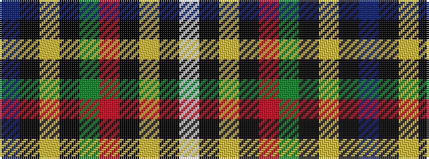

BKYKGRKYKW

It is a 10 stripe tartan.

<figure class="pat-woven">

<figcaption>idealised sample</figcaption>
</figure>

## Colour Sequence



## Tartans with this colour sequence

| Tartans |
|---------------|
| [US Army Civil Affairs](/variants/s10/p6k2ly6k60y60r6k25lyi4k2w6/)|
||
| [US Army Civil Affairs (Military)](/variants/s10/dp6k2lo6k60y60r6k25ly4k2w6/)|
||
