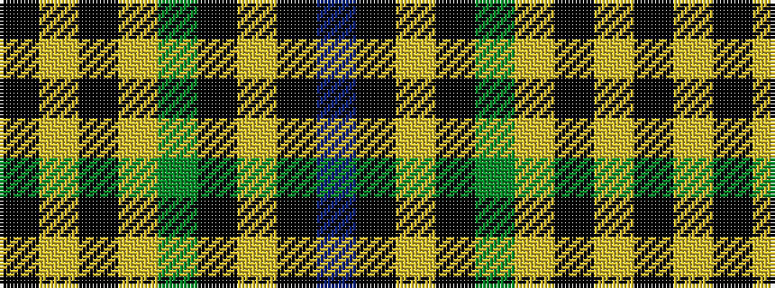

BKYKGYKYK

It is a 9 stripe tartan.

<figure class="pat-woven">

<figcaption>idealised sample</figcaption>
</figure>

## Colour Sequence



## Tartans with this colour sequence

| Tartans |
|---------------|
| [Bro-Leon](/setts/s9/k4lo17k2lo2g7k2lo2k22db4~x2/)|
||
