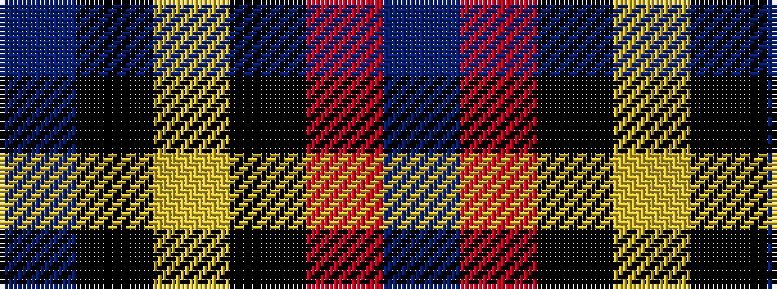

BKYKRB

It is a 6 stripe tartan.

<figure class="pat-woven">

<figcaption>idealised sample</figcaption>
</figure>

## Colour Sequence



## Tartans with this colour sequence

| Tartans |
|---------------|
| [Cetoloni (Personal)](/setts/s6/db1r12k6ly1k6db1~x4/)|
||
