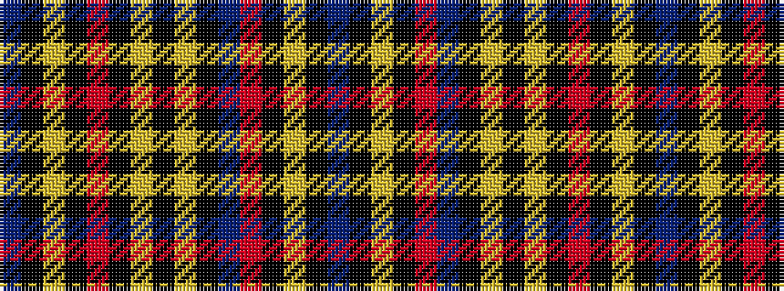

BKYKRBKYKYKRKYKB

It is a 16 stripe tartan.

<figure class="pat-woven">

<figcaption>idealised sample</figcaption>
</figure>

## Colour Sequence



## Tartans with this colour sequence

| Tartans |
|---------------|
| [Oneness](/variants/s16/db12k3ly2k3r12db12k2lo28k2ly2k2o2k2lo28k2db12~x2/)|
||
