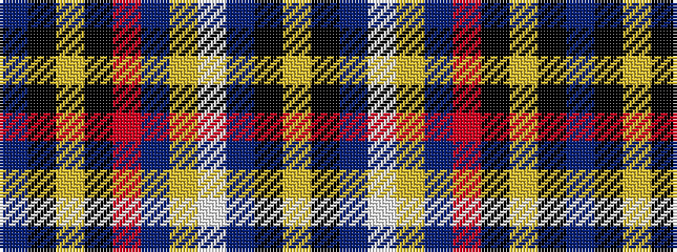

BKYKRBYWBKY

It is a 11 stripe tartan.

<figure class="pat-woven">

<figcaption>idealised sample</figcaption>
</figure>

## Colour Sequence



## Tartans with this colour sequence

| Tartans |
|---------------|
| [Scottish Banner, The](/variants/s11/b1k2ly5k2r31b3ly1w1db2k1ly1~x2/)|
||
