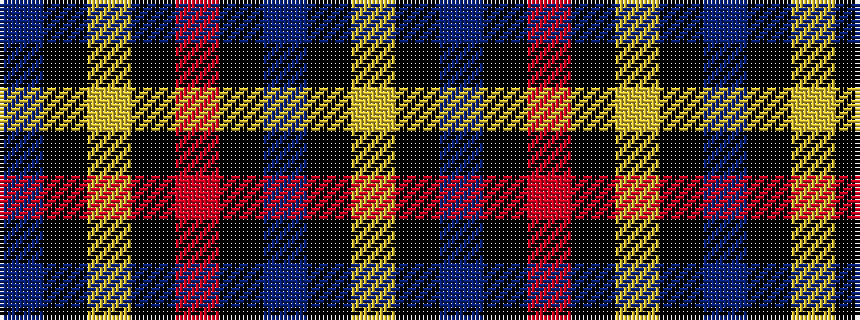

BKYKRKBKY

It is a 9 stripe tartan.

<figure class="pat-woven">

<figcaption>idealised sample</figcaption>
</figure>

## Colour Sequence



## Tartans with this colour sequence

| Tartans |
|---------------|
| [United States](/setts/s9/db7k5lr6k5r7k2db2k70lr2/)|
||
