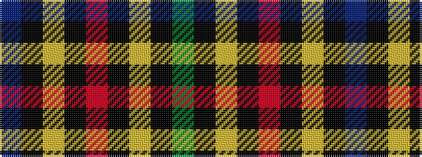

BKYKRKYKG

It is a 9 stripe tartan.

<figure class="pat-woven">

<figcaption>idealised sample</figcaption>
</figure>

## Colour Sequence



## Tartans with this colour sequence

| Tartans |
|---------------|
| [Scottish Tartan Society](/setts/s9/db20k10lo3k7r4k7lo3k8g20~x2/)|
||
| [Vosko](/setts/s9/db8k4lo2k3r2k3lo2k4g8~x4/)|
||
| [Vosko](/setts/s9/db25k12ly4k9r6k9ly4k12g25~x2/)|
||
