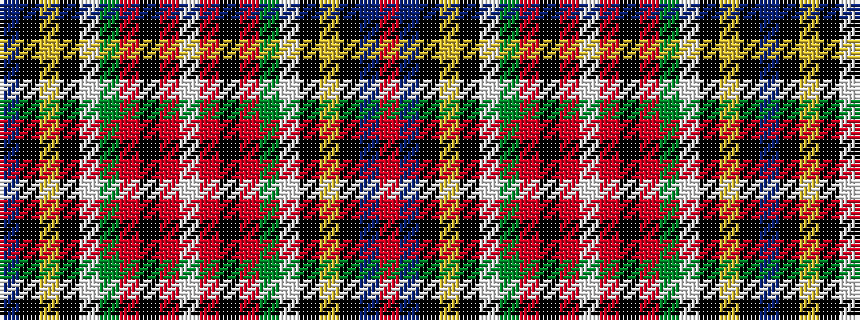

BKYKWGRKRWRKRGWKYKBR

It is a 20 stripe tartan.

<figure class="pat-woven">

<figcaption>idealised sample</figcaption>
</figure>

## Colour Sequence



## Tartans with this colour sequence

| Tartans |
|---------------|
| [Stewart/Stuart, Royal (No black line)](/setts/s20/r64b12k16lo2k4lb3g32r8k4r3lb2~x2/)|
||
