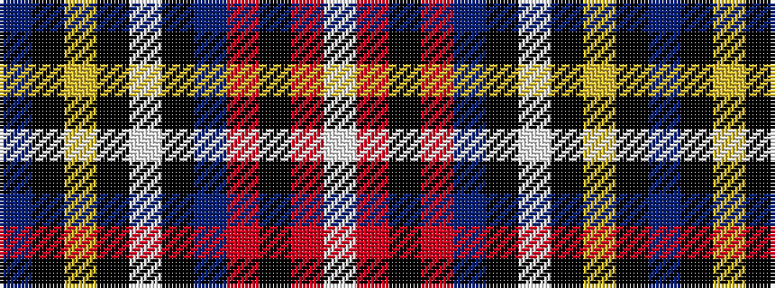

BKYKWKBRKRW

It is a 11 stripe tartan.

<figure class="pat-woven">

<figcaption>idealised sample</figcaption>
</figure>

## Colour Sequence



## Tartans with this colour sequence

| Tartans |
|---------------|
| [Lanyard Blue (Fashion)](/setts/s11/db90k10ly2k4w2k4b14r12k2r5w4/)|
||
