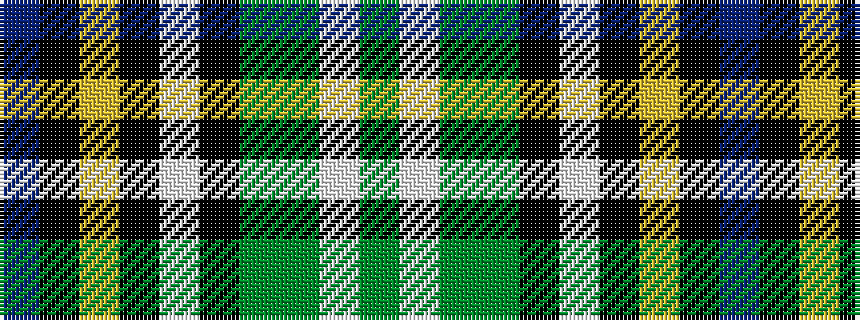

BKYKWKGGWG

It is a 10 stripe tartan.

<figure class="pat-woven">

<figcaption>idealised sample</figcaption>
</figure>

## Colour Sequence



## Tartans with this colour sequence

| Tartans |
|---------------|
| [MacLean of Kingairloch (Personal)](/setts/s10/b81k6ly1k2w2k2g12dy28w1dy4~x2/)|
||
| [MacLean of Kingairloch (Personal)](/setts/s10/b81k6ly1k2w2k2g12y28w1y4~x2/)|
||
