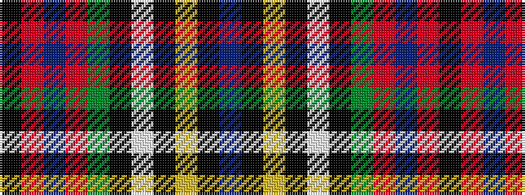

BKYKWKGRBRK

It is a 11 stripe tartan.

<figure class="pat-woven">

<figcaption>idealised sample</figcaption>
</figure>

## Colour Sequence



## Tartans with this colour sequence

| Tartans |
|---------------|
| [MacLean](/variants/s11/db8k8ly2k3w3k3dg24r16db3r4k2~x2/)|
||
| [MacLean](/variants/s11/db8k8ly2k3w3k3g24r16db3r4k2~x2/)|
||
| [MacLean Variation](/variants/s11/dp45k12ly4k4w6k4dg50r57dp4r10k4~x2/)|
||
| [MacLean of Duart #2](/variants/s11/t8k4ly1k2w3k2dg12r24t2r3k2~x2/)|
||
| [MacLean of Duart #4](/variants/s11/t13k6ly2k3w4k3dg22r31t3r4k2~x2/)|
||
| [MacLean of Duart #5](/variants/s11/t14k8ly2k3w4k3dg21r48t4r5k3~x2/)|
||
| [MacLean of Duart 1](/variants/s11/t13k6ly2k3w4k3g22r31t3r4k2~x2/)|
||
| [MacLean of Duart 2](/variants/s11/t14k8ly2k3w4k3g21r48t4r5k3~x2/)|
||
| [MacLean of Duart 3](/variants/s11/t16k12ly4k4w6k4g32r50t6r8k3/)|
||
| [MacLean of Duart 4](/variants/s11/t8k4ly1k2w3k2g12r24t2r3k2~x2/)|
||
| [MacLean, Variation](/variants/s11/p45k12ly4k4w6k4g50r57p4r10k4~x2/)|
||
| [Maclean of Duart (Wilsons) (Clan)](/variants/s11/t16k12ly4k4w6k4dg32r50t6r8k3/)|
||
| [Unidentified Furnishing](/variants/s11/db24k6lo4k6lb4k6g24r48db5r6k5~x2/)|
||
