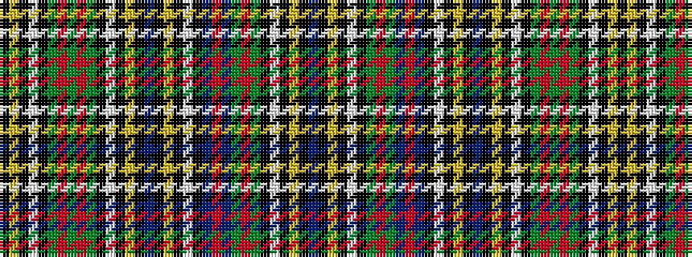

BKYKWKGRGBRBKWKYKBKYKWKGRGRGKWKYK

It is a 33 stripe tartan.

<figure class="pat-woven">

<figcaption>idealised sample</figcaption>
</figure>

## Colour Sequence



## Tartans with this colour sequence

| Tartans |
|---------------|
| [Hawick](/setts/s33/k2lo2k3w2k2g16r2g24r2g16k2w2k3lo2k4db4k4lo2k3w2k2db12r2db12g12r2g12k2w2k3lo2k4db2~x2/)|
||
