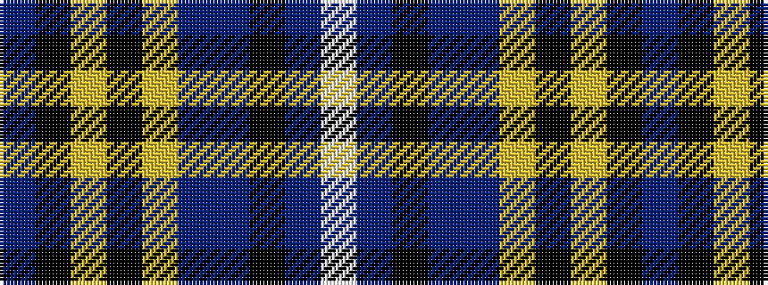

BKYKYBBKBW

It is a 10 stripe tartan.

<figure class="pat-woven">

<figcaption>idealised sample</figcaption>
</figure>

## Colour Sequence



## Tartans with this colour sequence

| Tartans |
|---------------|
| [Lochcarron of Scotland Diamond Jubilee](/setts/s10/dp46k12ly3k3lr3dp11db5k2db7w2~x2/)|
||
