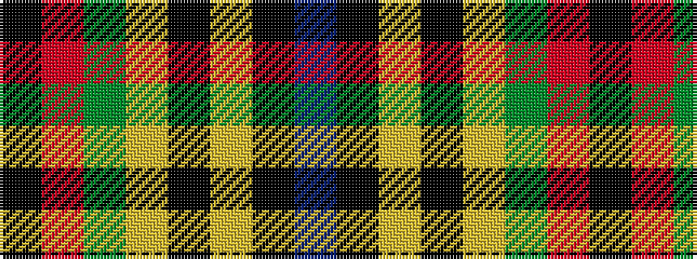

BKYKYGRK

It is a 8 stripe tartan.

<figure class="pat-woven">

<figcaption>idealised sample</figcaption>
</figure>

## Colour Sequence



## Tartans with this colour sequence

| Tartans |
|---------------|
| [MacBeth (Fashion)](/variants/s8/db42k6lo2k3lo2g10r7k2~x2/)|
||
