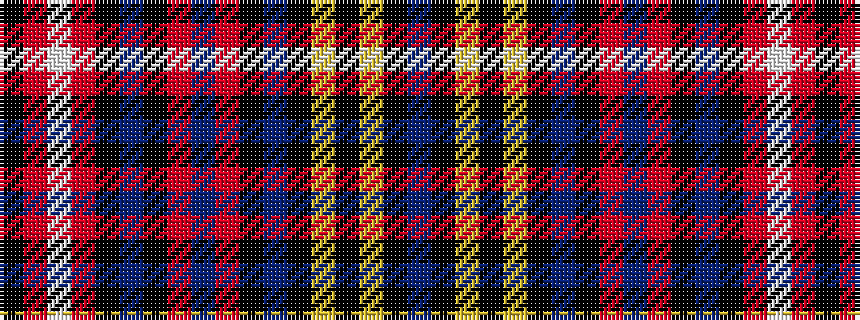

BKYKYKBKRBRKBKRWRK

It is a 18 stripe tartan.

<figure class="pat-woven">

<figcaption>idealised sample</figcaption>
</figure>

## Colour Sequence



## Tartans with this colour sequence

| Tartans |
|---------------|
| [Buchanan Variant](/variants/s18/b8k3ly22k3ly22k3b8k3o22b8o22k3b8k3r14w3r14k6~x2/)|
||
