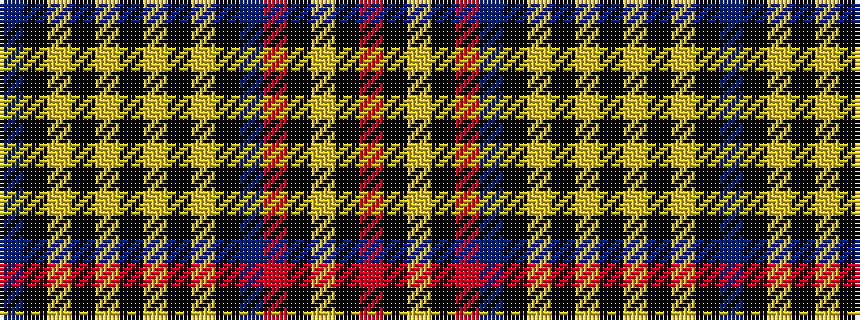

BKYKYKYKYKBRKYKR

It is a 16 stripe tartan.

<figure class="pat-woven">

<figcaption>idealised sample</figcaption>
</figure>

## Colour Sequence



## Tartans with this colour sequence

| Tartans |
|---------------|
| [Oneness](/setts/s16/db12k2loi28k2lr2k2lo2k2loi28k2db12r12k3lo2k3r12~x2/)|
||
