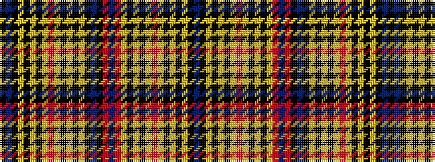

BKYKYKYRYKYKYRBRKBKYKYKYRYKYKYKBK

It is a 33 stripe tartan.

<figure class="pat-woven">

<figcaption>idealised sample</figcaption>
</figure>

## Colour Sequence



## Tartans with this colour sequence

| Tartans |
|---------------|
| [Hawick (District)](/variants/s33/k10db1k5lo1k1lo1k1lo1r2lo1k1lo1k1lo1k5db1k5r5db1r5lo1k1lo1k1lo1r2lo1k1lo1k1lo1k5db1~x4/)|
||
