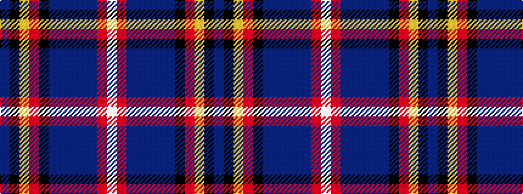

BKYRKBBBBBRW

It is a 12 stripe tartan.

<figure class="pat-woven">

<figcaption>idealised sample</figcaption>
</figure>

## Colour Sequence



## Tartans with this colour sequence

| Tartans |
|---------------|
| [Meirhaeghe, Van](/variants/s12/db28k6lo2r2k6db12dbi5db5dbi5db3r8w3~x2/)|
||
| [Meirhaeghe, Van](/variants/s12/dbi28k6ly2r2k6dbi12db5dbi5db5dbi3r8w3~x2/)|
||
