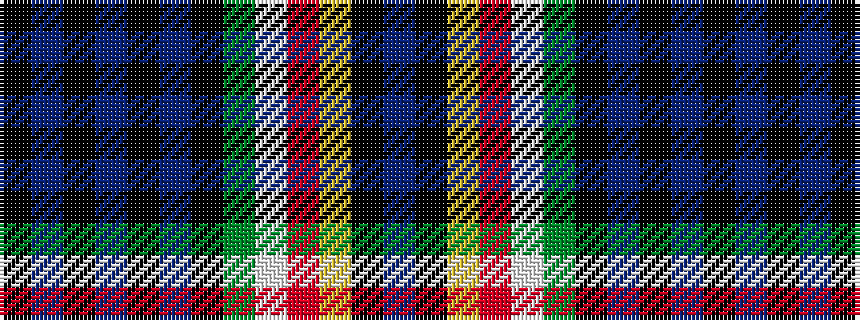

BKYRWGKBKBKBK

It is a 13 stripe tartan.

<figure class="pat-woven">

<figcaption>idealised sample</figcaption>
</figure>

## Colour Sequence



## Tartans with this colour sequence

| Tartans |
|---------------|
| [Western Australia-Pending (District)](/setts/s13/k114t2k3t3k5t5k2g5w6r5ly3k3db14/)|
||
