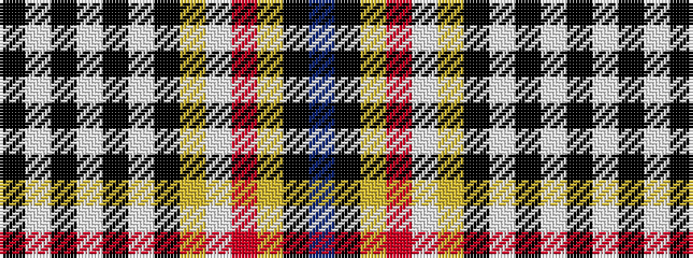

BKYRWYKWKWKWK

It is a 13 stripe tartan.

<figure class="pat-woven">

<figcaption>idealised sample</figcaption>
</figure>

## Colour Sequence



## Tartans with this colour sequence

| Tartans |
|---------------|
| [Western Australia (Scottish Associations)](/setts/s13/k114lt2k3lt3k5lt5k2lg5w6r5ly3k3db14/)|
||
