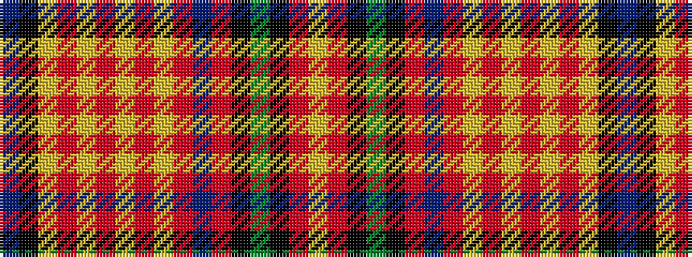

BKYRYRYRYRBRKGKRY

It is a 17 stripe tartan.

<figure class="pat-woven">

<figcaption>idealised sample</figcaption>
</figure>

## Colour Sequence



## Tartans with this colour sequence

| Tartans |
|---------------|
| [Innes Dress, Red (Dance)](/variants/s17/b3k2lr20r2lr3r2lr3r4lo3r2db4r2k2g6k3r2lr3~x2/)|
||
