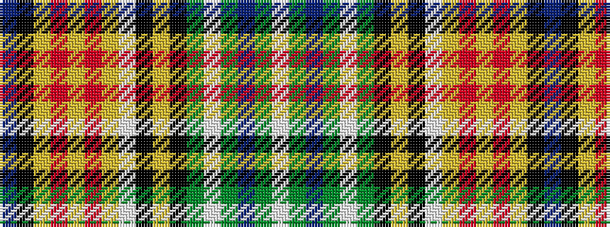

BKYRYRYWKYKGWGBGW

It is a 17 stripe tartan.

<figure class="pat-woven">

<figcaption>idealised sample</figcaption>
</figure>

## Colour Sequence



## Tartans with this colour sequence

| Tartans |
|---------------|
| [York Puppet Tartan](/variants/s17/dp11k1lo4r1lo1r1lo3w2k2ly2k3dy2w3dy3db3dy2w2~x2/)|
||
