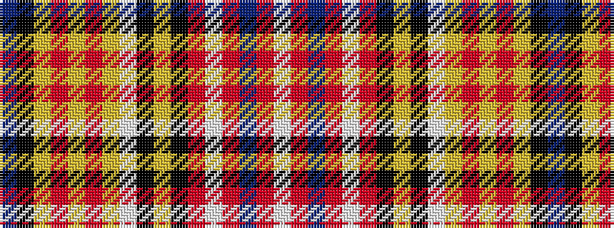

BKYRYRYWKYKRWRBRW

It is a 17 stripe tartan.

<figure class="pat-woven">

<figcaption>idealised sample</figcaption>
</figure>

## Colour Sequence



## Tartans with this colour sequence

| Tartans |
|---------------|
| [York Puppet](/setts/s17/p11k1lo4r1lo1r1lo3w2k2ly2k3o2w3o3db3o2w2~x2/)|
||
