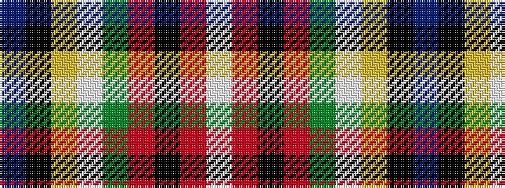

BKYWGRKRW

It is a 9 stripe tartan.

<figure class="pat-woven">

<figcaption>idealised sample</figcaption>
</figure>

## Colour Sequence



## Tartans with this colour sequence

| Tartans |
|---------------|
| [Stewart Blue MINI Tartan Tartan Number: 5566. Earliest known date: Generated for display purpose only for Dupion Silk. reduced copy of the 556 Stewart Blue. See products available Copyright © Blair Urquhart, Comrie, 2015](/setts/s9/db20k3ly1w1g3r3k1r2w1~x2/)|
||
