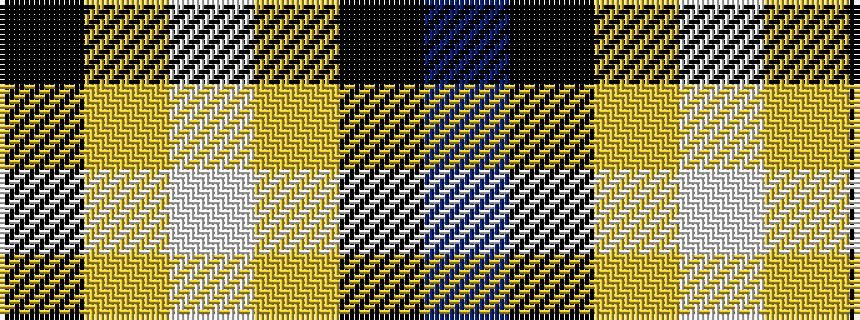

BKYWYK

It is a 6 stripe tartan.

<figure class="pat-woven">

<figcaption>idealised sample</figcaption>
</figure>

## Colour Sequence



## Tartans with this colour sequence

| Tartans |
|---------------|
| [London Fog Black](/setts/s6/k10lr2w5lr4k50b2~x2/)|
||
