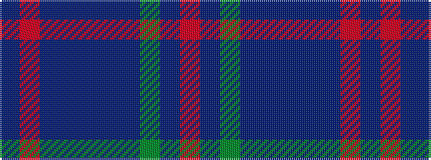

BRBBBBBGBR

It is a 10 stripe tartan.

<figure class="pat-woven">

<figcaption>idealised sample</figcaption>
</figure>

## Colour Sequence



## Tartans with this colour sequence

| Tartans |
|---------------|
| [Calum's Cabin](/variants/s10/db32o4dt12db2dt4db2dt2y16db67o6/)|
||
