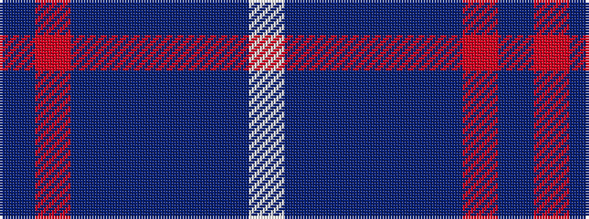

BRBBBBBW

It is a 8 stripe tartan.

<figure class="pat-woven">

<figcaption>idealised sample</figcaption>
</figure>

## Colour Sequence



## Tartans with this colour sequence

| Tartans |
|---------------|
| [A2 (Personal)](/setts/s8/dt1r1dt10t1dt1t5dt1w1~x6/)|
||
