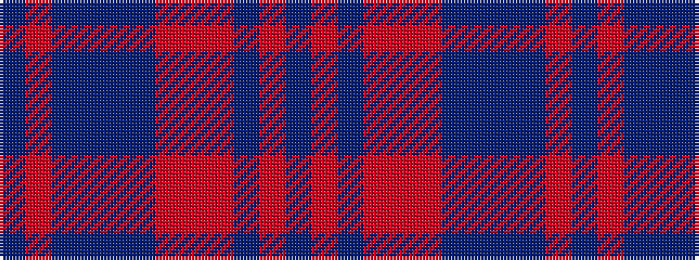

BRBBBBRRRBRB

It is a 12 stripe tartan.

<figure class="pat-woven">

<figcaption>idealised sample</figcaption>
</figure>

## Colour Sequence



## Tartans with this colour sequence

| Tartans |
|---------------|
| [Pride of Scotland, Silver (Fashion)](/setts/s12/n9o2n2r2o18r2n2n1n1n19r33n2~x2/)|
||
