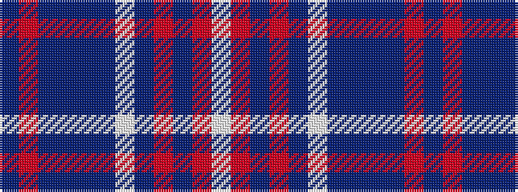

BRBBBBWBRBRW

It is a 12 stripe tartan.

<figure class="pat-woven">

<figcaption>idealised sample</figcaption>
</figure>

## Colour Sequence



## Tartans with this colour sequence

| Tartans |
|---------------|
| [Plymouth Armada](/setts/s12/db40r2db7do5dr2db3w2db10o6db2o4w2~x2/)|
||
| [Plymouth Armada (Commemorative)](/setts/s12/db40r2db7db5dr2db3w2db10o6db2o4w2~x2/)|
||
