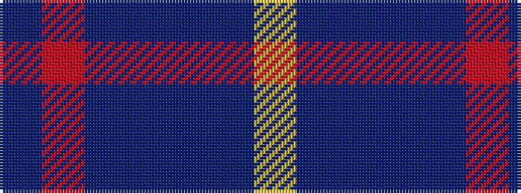

BRBBBBY

It is a 7 stripe tartan.

<figure class="pat-woven">

<figcaption>idealised sample</figcaption>
</figure>

## Colour Sequence



## Tartans with this colour sequence

| Tartans |
|---------------|
| [Int. Police Association (Official)](/setts/s7/db7r3db26t2db2t26ly4~x2/)|
||
