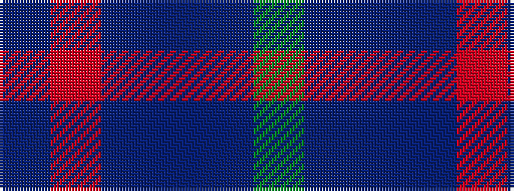

BRBBBG

It is a 6 stripe tartan.

<figure class="pat-woven">

<figcaption>idealised sample</figcaption>
</figure>

## Colour Sequence



## Tartans with this colour sequence

| Tartans |
|---------------|
| [International Festival of Authors](/variants/s6/dp30m5dp5t4dp4g12~x2/)|
||
| [International Festival of Authors (C](/variants/s6/dp30m5dp5b4dp4g12~x2/)|
||
