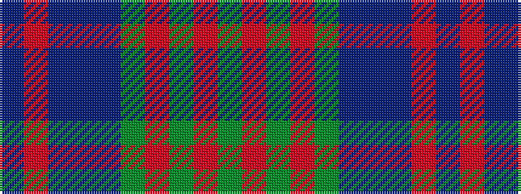

BRBBBGRGRG

It is a 10 stripe tartan.

<figure class="pat-woven">

<figcaption>idealised sample</figcaption>
</figure>

## Colour Sequence



## Tartans with this colour sequence

| Tartans |
|---------------|
| [Stewart of Appin 2](/variants/s10/g11r4g4r7g41db11t4db41r4db8/)|
||
| [Stewart of Appin Htg (error)](/variants/s10/g8r3g3r5g26db7t3db28r3db6~x2/)|
||
| [Stuart/Stewart of Appin](/variants/s10/dg8r3dg3r5dg26db7t3db28r3db6~x2/)|
||
| [Stuart/Stewart of Appin #2](/variants/s10/dg11r4dg4r7dg41db11t4db41r4db8/)|
||
