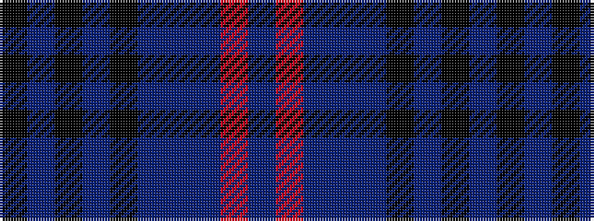

BRBBBKBKBK

It is a 10 stripe tartan.

<figure class="pat-woven">

<figcaption>idealised sample</figcaption>
</figure>

## Colour Sequence



## Tartans with this colour sequence

| Tartans |
|---------------|
| [Lochnagar Dark Fashion Tartan](/variants/s10/k8n1k40n1k16n16dt6n3r3n6~x2/)|
||
