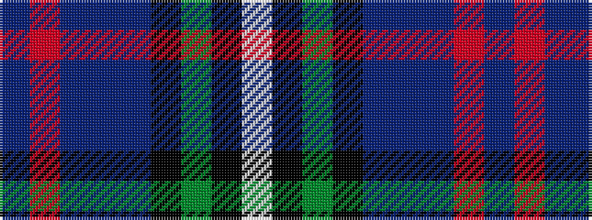

BRBBBKGKW

It is a 9 stripe tartan.

<figure class="pat-woven">

<figcaption>idealised sample</figcaption>
</figure>

## Colour Sequence



## Tartans with this colour sequence

| Tartans |
|---------------|
| [Hogg Dress](/setts/s9/t34r3t8dt4t8k24g34k2w6/)|
||
| [Hogg Dress (Name)](/setts/s9/t34r3t8db4t8k24g34k2w6/)|
||
