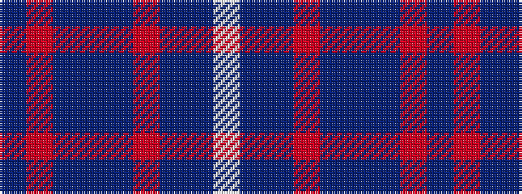

BRBBBRBBW

It is a 9 stripe tartan.

<figure class="pat-woven">

<figcaption>idealised sample</figcaption>
</figure>

## Colour Sequence



## Tartans with this colour sequence

| Tartans |
|---------------|
| [Brash](/variants/s9/db60r5db60dt40db36r10db36dt40w5/)|
||
| [Brash](/variants/s9/db60r5db60b40db36r10db36b40w5/)|
||
