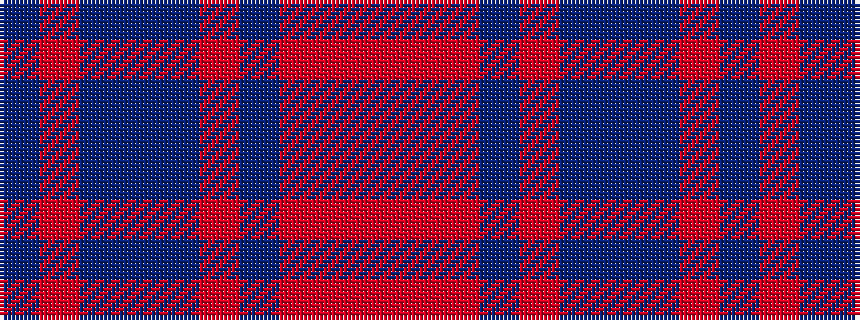

BRBBBRBRRR

It is a 10 stripe tartan.

<figure class="pat-woven">

<figcaption>idealised sample</figcaption>
</figure>

## Colour Sequence



## Tartans with this colour sequence

| Tartans |
|---------------|
| [Dark Lochnagar](/setts/s10/do6o1do40n1do12o12n6o2r2o4~x2/)|
||
| [Lochnagar Dark (Fashion)](/setts/s10/do6o1do40n1do12o12dp6o2r2o4~x2/)|
||
