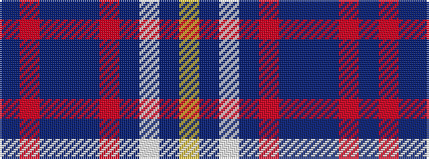

BRBBBRBWBY

It is a 10 stripe tartan.

<figure class="pat-woven">

<figcaption>idealised sample</figcaption>
</figure>

## Colour Sequence



## Tartans with this colour sequence

| Tartans |
|---------------|
| [Boswell (Name)](/variants/s10/t9r2t2dt12t2r2t12w1t15ly2~x4/)|
||
