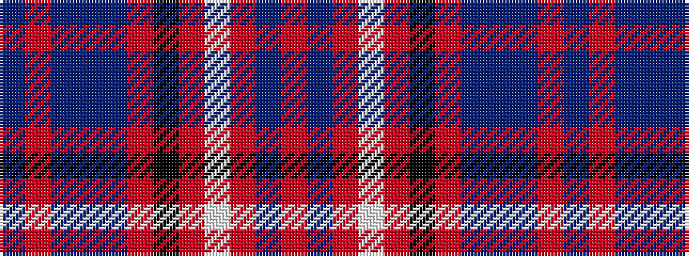

BRBBBRKRWRBR

It is a 12 stripe tartan.

<figure class="pat-woven">

<figcaption>idealised sample</figcaption>
</figure>

## Colour Sequence



## Tartans with this colour sequence

| Tartans |
|---------------|
| [Orkney Magnus](/setts/s12/o14db1o19w1o18k3o1dt7db2dt1o1n4~x2/)|
||
