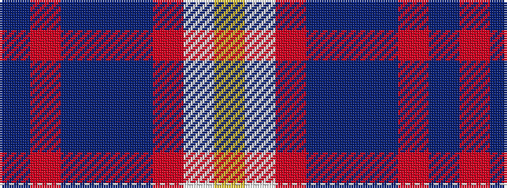

BRBBBRWY

It is a 8 stripe tartan.

<figure class="pat-woven">

<figcaption>idealised sample</figcaption>
</figure>

## Colour Sequence



## Tartans with this colour sequence

| Tartans |
|---------------|
| [Boxing Scotland](/variants/s8/db26r2t16db23t16r2w2ly1~x2/)|
||
