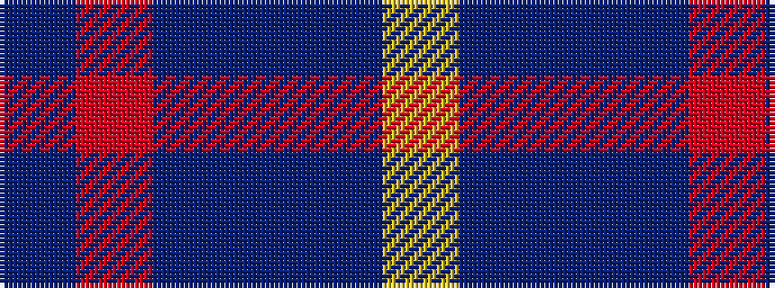

BRBBBY

It is a 6 stripe tartan.

<figure class="pat-woven">

<figcaption>idealised sample</figcaption>
</figure>

## Colour Sequence



## Tartans with this colour sequence

| Tartans |
|---------------|
| [Cameron Hunting](/setts/s6/do15r5do30b32do4lo3~x2/)|
||
